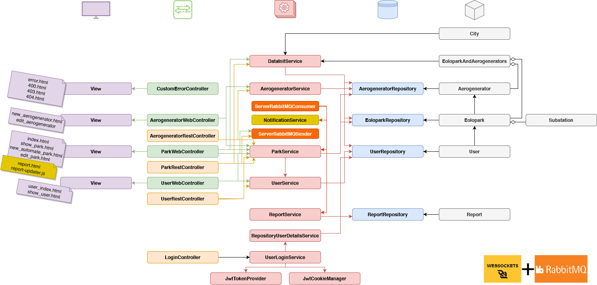

# EoloPark Manager

## Table of contents

1. [Authorship](#1-Authorship)
2. [Description of the project](#2-Description-of-the-project)
3. [Diagrams of the web application](#3-Diagrams-of-the-web-application)
    1. [Navigation diagram](#31-Navigation-diagram)
    2. [Entity Relationship Diagram](#32-Entity-Relationship-Diagram)
    3. [Class and template diagrams](#34-Class-and-template-diagrams)
4. [API REST Documentation](#4-API-REST-Documentation)
5. [Docker images creation instructions](#5-Docker-images-creation-instructions)
    1. [Server image](#51-Server-image)
    2. [Planner image](#52-Planner-image)
    3. [WindService image](#53-WindService-image)
    4. [GeoService image](#54-GeoService-image)
    5. [Automated process via script](#55-Automated-process-via-script)
6. [Deployment instructions](#6-Deployment-instructions)
    1. [Mononode deployment](#61-Mononode-deployment)
    2. [Multinode deployment](#62-Multinode-deployment)
    3. [Kubernetes deployment](#63-Kubernetes-deployment)
7. [Credentials to log in](#7-Credentials-to-log-in)
8. [Potential enhancements](#8-Potential-enhancements)

## 1 Authorship

    Original publish date: Apr, 2024
    License: MIT
    Authors: Alejandro Asensio
             Eric Martínez (e dot martinezg dot 2019 at alumnos dot urjc dot es)
             Adrián Rubio (a dot rubio dot 2020 at alumnos dot urjc dot es)
             Alberto López (a dot lopezgo dot 2019 at alumnos dot urjc dot es)

> **Disclaimer**: This work was created as part of my academic coursework at King Juan Carlos University. While I claim copyright for the selection and arrangement of the content, the copyright for the original materials used in this work is held by the university and the instructors, Micael Gallego and Iván Chicano.

## 2 Description of the project

This repository hosts the source code and required files to deploy and run a distributed application whose purpose is to simulate a **management webapp to generate and manage wind farms**.

It consists of six separate modules: server, planner, windservice, geoservice, the database module and the message broker module. Each module focuses on a specific task and has limited functionality. These independent modules communicate seamlessly with each other using various methods like queues, web sockets, or gRPC.

This project is intended to be a fully functional distributed web application. We use Docker technology to containerize the different modules, Docker Compose to orchestrate them in a single instance, and Kubernetes to orchestrate them in a cluster. Apart from the deployment, the application can be deployed in three different topologies: mononode, multinode, and Kubernetes.

## 3 Diagrams of the web application

### 3.1 Navigation diagram


### 3.2 Entity Relationship Diagram


### 3.4 Class and template diagrams

#### 3.4.1 Architecture diagram


#### 3.4.2 Server diagram



#### 3.4.3 Planner diagram


#### 3.4.4 GeoService diagram


#### 3.4.5 WindService diagram


## 4 API REST Documentation

- [OpenAPI Specification File](server/api-docs/api-docs.yaml)
- Documentation in HTML:
    - [.html (directly from Swagger, only works once the application is running)](https://localhost:8443/swagger-ui/index.html)
    - [.html (file in /api-docs/html)](server/api-docs/api-redoc.html)

## 5 Docker images creation instructions

In order to create the different Docker images for each module of the application, you can either **follow the instructions from 5.1 to 5.4** or **use the .sh script that automates the process (5.5)**.

**Prerequisites:**

- Docker must be installed in the system and the Docker Hub credentials must be accessible to push images.
- Java must be installed in the system for the planner and windservice modules (not necessary if the script is used).
- Maven must be installed in the system for the server and geoservice modules (not necessary if the script is used).
- The GitHub repository must be cloned in the system.

### 5.1 Server image

This image is created with the **JIB plugin for Maven**, included in the pom.xml of the server project. Follow these steps to build the image:

- Make sure that you are in the root directory of the server project, /microservice-restful-webapp/server.
- Build the Docker image for the server module with the following command:

`mvn compile jib:dockerBuild -Dimage-name=[username]/[image-name]:[tag]`

where [username] is the Docker Hub username, [image-name] is the name of the image, and [tag] is the version of the image. If no image name is provided, the default name is taken from the pom.xml file.

- You can then push the image to the Docker Hub repository with:

`docker push [username]/[image-name]:[tag]`

where [username] is the Docker Hub username, [image-name] is the name of the image, and [tag] is the version of the image.

- Alternatively, to build and directly push the image, use the following command:

`mvn compile jib:build -Dimage-name=[username]/[image-name]:[tag]`

where [username] is the Docker Hub username, [image-name] is the name of the image, and [tag] is the version of the image. If no image name is provided, the default name is taken from the pom.xml file. This command requires that your Docker credentials are accessible, be it through the Docker CLI or the Docker configuration file.

### 5.2 Planner image

This image is built with a **multi-stage Dockerfile**. Follow these steps to build the image:

- Make sure that you are in the root directory of the repository, /microservice-restful-webapp.
- Build the Docker image for the planner module with the following command:

`docker build -f planner.Dockerfile -t [username]/[image-name]:[tag] .`

where [username] is the Docker Hub username, [image-name] is the name of the image, and [tag] is the version of the image.

- You can then push the image to the Docker Hub repository with:

`docker push [username]/[image-name]:[tag]`

where [username] is the Docker Hub username, [image-name] is the name of the image, and [tag] is the version of the image.

### 5.3 WindService image

This image is built with a **multi-stage Dockerfile**. Follow these steps to build the image:

- Make sure that you are in the root directory of the repository, /microservice-restful-webapp.
- Build the Docker image for the windservice module with the following command:

`docker build -f windservice.Dockerfile -t [username]/[image-name]:[tag] .`

where [username] is the Docker Hub username, [image-name] is the name of the image, and [tag] is the version of the image.

- You can then push the image to the Docker Hub repository with:

`docker push [username]/[image-name]:[tag]`

where [username] is the Docker Hub username, [image-name] is the name of the image, and [tag] is the version of the image.

### 5.4 GeoService image

For Geoservice, **Spring Buildpacks are used** to build the image. Follow these steps to build the image:

- Make sure that you are in the root directory of the geoservice project, /microservice-restful-webapp/geoservice.
- Build the Docker image for the geoservice module with the following command:

`mvn spring-boot:build-image -Dimage-name=[username]/[image-name]:[tag]`

where [username] is the Docker Hub username, [image-name] is the name of the image, and [tag] is the version of the image. If no image name is provided, the default name is taken from the pom.xml file.

- You can then push the image to the Docker Hub repository with:

`docker push [username]/[image-name]:[tag]`

where [username] is the Docker Hub username, [image-name] is the name of the image, and [tag] is the version of the image.

### 5.5 Automated process via script

To automate the process of building the Docker images, use the script provided in the root directory of the project,**create_docker_images.sh**. This script builds the images for the server, planner, windservice, and geoservice modules, and **can be executed even if neither Java nor Maven are installed in the system (Docker is required)**.

To execute the script, follow these steps:

- Make sure that you are in the root directory of the repository, /microservice-restful-webapp.
- Run the script in a bash shell with the following command (example for the git bash):

`./create_docker_images.sh`

This script verifies that the Docker CLI is installed and accessible, asks for a username and a tag for the images, and proceeds to build the images with this information. In this script, the Maven wrapper ./mvnw is used to circunvent the lack of Maven in the system for the server and the geoservice image creation. It is important to mention that, in the case of the server image, the script uses the version of the JIB command that only builds the image, not pushing it to the repository.

For that purpose, there is another script in the project root directory, **push_docker_images.sh**, that automates the process of pushing the images to the Docker Hub repository. This script was not in the requirements of the project, but proved useful to automate the image pushing process and **can be executed even if neither Java nor Maven are installed in the system (Docker is required)** as well.This script must be executed **after the images have been built** with the previous script or individually. To execute the script, follow these steps:

- Make sure that you are in the root directory of the repository, /microservice-restful-webapp.
- Run the script in a bash shell with the following command (example for the git bash):

`./push_docker_images.sh`

This script verifies that the Docker CLI is installed and accessible, asks for a username and a tag for the images, and proceeds to push the images to the Docker Hub repository with this information. It uses a series of docker push commands to push the images, that should be available in the local Docker repository.

## 6 Deployment instructions

This section contains step-by-step instructions (including the corresponding commands) to deploy the application in each of the different modes required by the project.

**Docker must be installed in all the instances**, regardless of the deployment mode. To install Docker, follow the instructions below:

- Create a group for Docker and add the current user to it:

```
groupadd docker
usermod -aG docker $USER
newgrp docker
```

- Download and configure the required packages, and proceed to install docker engine and docker command line interface (CLI):

```
apt install ca-certificates curl
install -m 0755 -d /etc/apt/keyrings
curl -fsSL https://download.docker.com/linux/ubuntu/gpg -o /etc/apt/keyrings/docker.asc
chmod a+r /etc/apt/keyrings/docker.asc
echo "deb [arch=$(dpkg --print-architecture) signed-by=/etc/apt/keyrings/docker.asc] https://download.docker.com/linux/ubuntu $(. /etc/os-release && echo "$VERSION_CODENAME") stable" | tee /etc/apt/sources.list.d/docker.list > /dev/null
apt update
apt install docker-ce docker-ce-cli containerd.io docker-buildx-plugin docker-compose-plugin -y
systemctl enable docker
```

### 6.1 Mononode deployment

In the **mononode deployment, all the modules of the application are deployed in a single instance with a single docker compose file**.

After accessing the instance dedicated to the mononode deployment, follow these steps:

- Clone the repository:

`git clone https://github.com/aaseper/microservice-restful-webapp`

- Once the repository is cloned, use the docker compose in the project root:

`docker compose -f ./microservice-restful-webapp/mononode-docker-compose.yml up -d`

- To ensure that the application is running, check the logs of the server, the main module of the application:

`docker logs server`

Now the application should be running via the mononode deployment and can be located through the browser at https://[ip]:8443.

where [ip] is the ip of the machine where the application is running.

- To stop the application, stop the containers:

`docker stop $(docker ps -a -q)`

### 6.2 Multinode deployment

In the **multinode deployment, the different modules of the application are deployed in separate instances**. The instances are divided into three groups: server, services, and planner. Each group is deployed in a different instance, which uses a specific docker compose file.

The first instance to be accessed could either be the server instance or the services instance. Although the order of deployment between them is not important, it is necessary to deploy both these instances before the planner instance to ensure that the planner can communicate with them (the planner depends on the server and services). In this case, the server instance will be accessed first. The server instance is tasked with hosting the web application, the database, and the message broker. After accessing the instance, follow these steps:

- Clone the repository:

`git clone https://github.com/aaseper/microservice-restful-webapp`

- Once the repository is cloned, use the specific docker compose in the project root:

`docker compose -f ./microservice-restful-webapp/multinode-1-docker-compose-server.yml up -d`

- The server itself must be waiting (via health check) for the database and the message broker to be ready, and once they are, finish the starting process. Check the logs of the server container to ensure that it is running correctly:

`docker logs server`

Then, the services instance must be accessed. The services instance is responsible for hosting the geoservice and windservice modules. These services must be deployed before the planner module to ensure that the planner can communicate with them (the planner depends on the services). After accessing the instance, follow these steps:

- Clone the repository:

`git clone https://github.com/aaseper/microservice-restful-webapp`

- Once the repository is cloned, use the specific docker compose in the project root:

`docker compose -f ./microservice-restful-webapp/multinode-2-docker-compose-geo-wind.yml up -d`

- Checking the logs of the geoservice and windservice containers could be useful to ensure that they are running correctly:

`docker logs geoservice`

`docker logs windservice`

Finally, the planner instance must be accessed. The planner instance is responsible for hosting the planner module. After accessing the instance, follow these steps:

- Clone the repository:

`git clone https://github.com/aaseper/microservice-restful-webapp`

- Once the repository is cloned, use the specific docker compose in the project root:

`docker compose -f ./microservice-restful-webapp/multinode-3-docker-compose-planner.yml up -d`

- Checking the logs of the planner container could be useful to ensure that it is running correctly:

`docker logs planner`

Now the application should be running via the multinode deployment and can be located through the browser
at https://[ip]:8443.

where [ip] is the ip of the machine where the application is running.

- To stop the application, stop the containers in each instance with the command:

`docker stop $(docker ps -a -q)`

### 6.3 Kubernetes deployment

In the **Kubernetes deployment, the different modules of the application are deployed in a Kubernetes cluster**. The CLI tool kubectl is used to interact with the cluster, and the Lens dashboard is used to monitor the cluster.

After accessing the instance dedicated to the Kubernetes deployment, follow these steps:

- Install Kubernetes. The following command installs the k3s distribution of Kubernetes:

`curl -sfL https://get.k3s.io | sh -s - --node-external-ip [ip]`

where [ip] is the external IP of the instance.

- Clone the repository:

`git clone https://github.com/aaseper/microservice-restful-webapp`

- Apply the Kubernetes manifests in the folder where they reside:

`kubectl apply -f ./microservice-restful-webapp/k8s/`

The application should be running via the Kubernetes deployment. To ensure that the application is running, check the status of the pods via console with `kubectl get pods` or through the Lens dashboard. In Lens, you can see all the logs of the pods and services as well. The application can be stopped via console again with kubectl or through the Lens dashboard.

The application is using NodePort to expose the application. Thus, the application can be accessed through the browser at https://[ip]:30001.

where [ip] is the external IP of the instance.

## 7 Credentials to log in

This section contains the credentials of the predefined users, including the admin:

**Credentials to log in (user/password -role-)**:

- admin/admin -admin-
- user/user -user-
- premium/premium -premium-
- alex/alex -user-
- david/david -user-
- jose/jose -user-

## 8 Potential enhancements

**API and data management:**

- The API should return park information directly rather than a report ID. Progress can be queried separately using a dedicated endpoint.
- Class and variable naming should avoid technology-specific references to maintain business logic abstraction.
- Business logic, data initialization, and communication services should be decoupled. Data initialization can leverage CSV files in PostConstruct methods instead of hardcoded values.
- REST controllers should solely interact with services, delegating database operations and business logic. Redundancy between REST and web layers can be eliminated through shared service usage.

**System design and error handling:**

- Careful consideration should be given to URL and request naming conventions.
- URL parameters using the ?= syntax should be avoided.
- The term "CreationProgress" is suggested as a more descriptive alternative to "Report".
- RabbitMQ message payloads should include an error field to enable exception handling in case of park creation failures, preventing inconsistent states.
